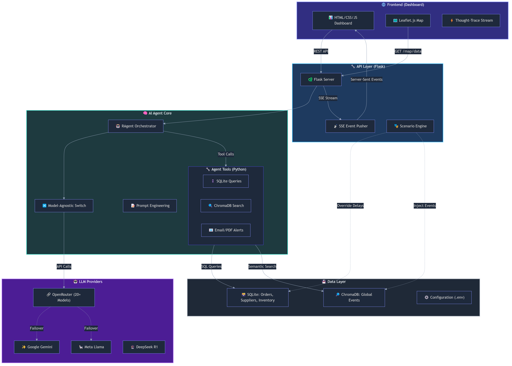
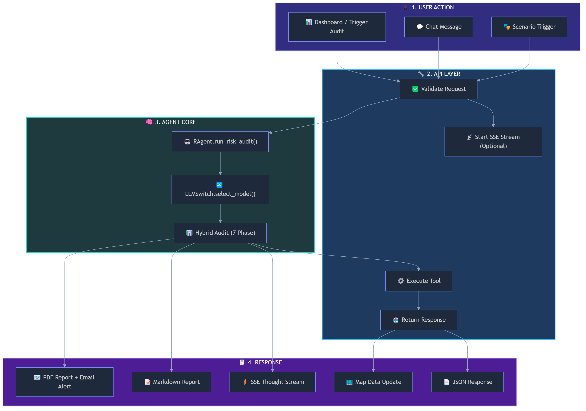
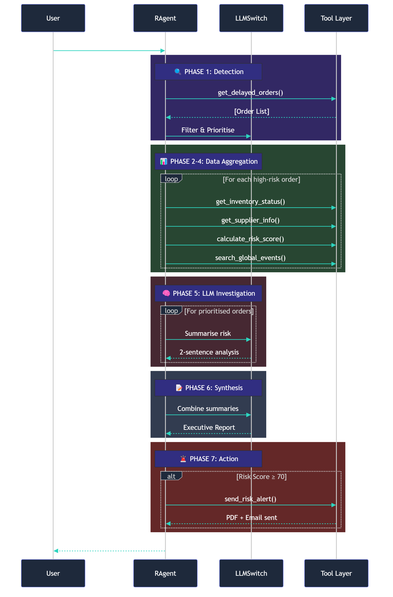
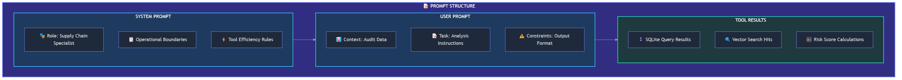
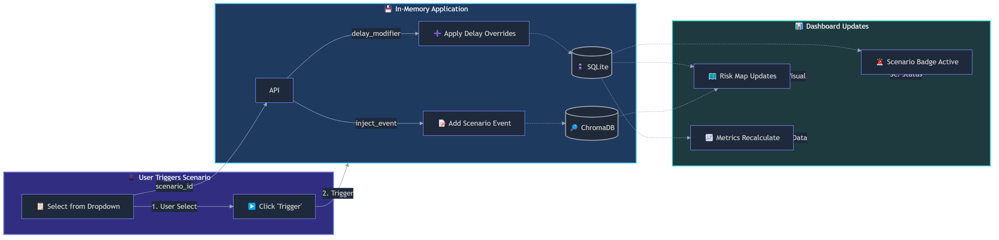

## Business Case

A German manufacturing SME imports electronic components from suppliers in Asia. One of the suppliers is affected by a port strike and shipment delays increase from 4 to 12 days. The procurement team only notices the issue after production inventory falls below the safe level.

Resilienz.AI continuously monitors supplier routes, logistics news, and inventory buffers. The platform detects the disruption early, explains the reason, and estimates the impact on production. It then recommends an alternative supplier and simulates the effect of switching.

As a result, the company can avoid production downtime, reduce emergency procurement costs, and react several days earlier than with traditional monitoring.

---

# Resilienz.AI — Autonomous Supply Chain Resilience Platform

> **Production-inspired AI Agent System for Supply Chain Risk Management**

---

## 🚀 Quick Demo (30 seconds)

```bash
# 1. Start backend
python api/app.py

# 2. Open dashboard
# → Open dashboard/index.html in your browser

# 3. Click "🚀 Start Audit"
# 4. Watch AI reasoning stream in real-time
```

👉 **Demo Video**: [need to add youtube demo link]

---

## Architecture TL;DR

- **Agent Loop**: Think → Act → Observe → Reflect
- **Deterministic Layer**: Risk scoring, delay calculation, inventory thresholds
- **LLM Layer**: Reasoning, prioritisation refinement, report generation
- **Tool Layer**: SQLite + Vector DB + email/PDF alerts
- **Resilience**: Multi-model failover via OpenRouter (20+ models)

---

## 1. Project Overview

**Resilienz.AI** is an autonomous AI-driven procurement cockpit designed for German manufacturing SMEs. It transforms reactive supply chain management into a proactive, intelligence-led operation through an autonomous "Think-Act-Loop" agent architecture.

### The Problem

Small and medium-sized manufacturing enterprises in Germany face a critical challenge: **supply chain disruptions can halt production lines**, yet they lack the resources of large corporations for dedicated risk monitoring teams. Reactive approaches mean discovering problems only after they impact delivery schedules.

### The Solution

Resilienz.AI employs a specialised AI agent that continuously monitors purchase orders, inventory levels, supplier performance, and global events to detect, analyse, and mitigate supply chain risks before they become production-stopping incidents.

### What Makes It Different

| Traditional Approach     | Resilienz.AI                       |
| ------------------------ | ---------------------------------- |
| Periodic manual reviews  | Continuous autonomous monitoring   |
| Black-box AI decisions   | Full thought-trace transparency    |
| Reactive problem-solving | Proactive risk detection           |
| Single LLM dependency    | Multi-model resilient architecture |
| Single data source       | Hybrid SQLite + Vector DB strategy |

---

## 2. Why Agent-Based Instead of Dashboard Analytics?

Traditional dashboards show data. Resilienz.AI acts on it.

| Dashboard Analytics           | Resilienz.AI Agent                |
| ----------------------------- | --------------------------------- |
| Shows raw data                | Detects risks automatically       |
| Requires human interpretation | Investigates causes automatically |
| Static filters and alerts     | Recommends specific actions       |
| Passive display               | Executes alerts when risk ≥ 70   |

**The shift**: Passive analytics → Active decision support system

The agent doesn't just display information. It:

1. Continuously monitors supply chain state
2. Investigates anomalies autonomously
3. Calculates risk using deterministic + LLM reasoning
4. Triggers escalation actions without human prompting

---

## 3. Autonomy Model

| Aspect                    | Implementation                                                        |
| ------------------------- | --------------------------------------------------------------------- |
| **Trigger Mode**    | Manual (via UI) + Ready for scheduled execution (cron-ready endpoint) |
| **Decision Making** | Fully automated risk evaluation                                       |
| **Actions**         | Alerting + recommendations (auto-escalation for risk score ≥ 70)     |
| **Human Override**  | Always possible via thought-trace visibility                          |

---

## 4. Key Features

### Intelligence Layer

| Feature                               | Description                                                                                                |
| ------------------------------------- | ---------------------------------------------------------------------------------------------------------- |
| **Real-Time Risk Detection**    | Monitors 50+ purchase orders against supplier status, inventory buffers, and global disruption signals     |
| **Think-Act-Loop Architecture** | Autonomous agent cycles through Think → Plan → Act → Observe → Reflect using LLM-guided tool selection |
| **Scenario Simulation**         | Zero-risk in-memory stress testing for geopolitical crises, port strikes, and energy disruptions           |

### Transparency Layer

| Feature                       | Description                                                                         |
| ----------------------------- | ----------------------------------------------------------------------------------- |
| **AI Thought-Trace**    | Real-time streaming of the agent's internal reasoning via Server-Sent Events (SSE)  |
| **Explainable Outputs** | Every risk finding includes the data sources, scoring factors, and confidence level |
| **Audit Trail**         | Complete logging of agent decisions for compliance and review                       |

### Visualisation Layer

| Feature                       | Description                                                                                   |
| ----------------------------- | --------------------------------------------------------------------------------------------- |
| **Global Risk Map**     | Interactive Leaflet.js map visualising supplier locations, shipping routes, and risk hotspots |
| **Route Tracking**      | Visual connection of factory hub to supplier locations with delay indicators                  |
| **Scenario Dashboards** | Real-time dashboard updates when stress-test scenarios are activated                          |

---

## 5. System Architecture



### Data Flow Architecture



### Component Responsibilities

| Component                 | Responsibility                                                        | Technology              |
| ------------------------- | --------------------------------------------------------------------- | ----------------------- |
| **RAgent (Brain)**  | Orchestrates reasoning loop, tool selection, and response synthesis   | Python 3.11+            |
| **LLMSwitch**       | Model-agnostic LLM routing with automatic failover and error handling | OpenRouter SDK          |
| **Tool Layer**      | Python functions callable by LLM for data retrieval and actions       | SQLite, ChromaDB        |
| **Auditing Module** | Hybrid audit logic: deterministic Python + LLM reasoning phases       | Python + LLM            |
| **API Server**      | REST endpoints, SSE streaming, scenario management                    | Flask + Flask-CORS      |
| **Dashboard**       | Glassmorphism UI, interactive map, thought-trace display              | Vanilla JS + Leaflet.js |
| **Data Layer**      | Structured facts (SQLite) + Semantic context (Vector DB)              | SQLite, ChromaDB        |

---

## 6. Agent Design

### Think-Act-Loop Architecture

Resilienz.AI implements a refined autonomous agent loop inspired by ReAct (Reason + Act) patterns with additional reflection cycles:



### Deterministic vs LLM Split

| What                       | Who Does It                    | Why                                           |
| -------------------------- | ------------------------------ | --------------------------------------------- |
| Risk scoring (0-100)       | **Deterministic** Python | Mathematically precise, no hallucination risk |
| Delay calculation          | **Deterministic** Python | Exact numbers required                        |
| Inventory threshold checks | **Deterministic** Python | Boolean logic, no ambiguity                   |
| Risk explanation           | **LLM**                  | Natural language generation                   |
| Prioritisation refinement  | **LLM**                  | Context-aware ordering                        |
| Report generation          | **LLM**                  | Professional formatting                       |
| Global event relevance     | **LLM + Vector DB**      | Semantic understanding                        |

### Prompt Engineering Strategy

The agent uses an **optimised prompt architecture** with efficient token management:



### Decision-Making Strategy

1. **Detection**: Python fetches all delayed orders
2. **Prioritisation**: LLM filters to top 5 critical orders
3. **Investigation**: Each order receives individual LLM analysis with context-aware truncation
4. **Synthesis**: Final LLM generates executive summary
5. **Action**: Auto-escalation if risk score ≥ 70

---

## 7. Tools & Integrations

### Data Source Tools

| Tool                       | Data Source | Use Case                                 |
| -------------------------- | ----------- | ---------------------------------------- |
| `get_delayed_orders()`   | SQLite      | Identify orders with delivery delays     |
| `get_inventory_status()` | SQLite      | Check warehouse stock and days-of-cover  |
| `get_supplier_info()`    | SQLite      | Retrieve supplier reliability scores     |
| `search_global_events()` | ChromaDB    | Semantic search for external disruptions |

### Action Tools

| Tool                           | Target         | Use Case                                 |
| ------------------------------ | -------------- | ---------------------------------------- |
| `calculate_risk_score()`     | Internal Logic | Deterministic risk scoring (0-100)       |
| `get_alternative_supplier()` | SQLite         | Find backup suppliers for critical parts |
| `send_risk_alert()`          | Email + PDF    | Automated alert with mitigation plan     |

### External Integrations

| Integration              | Technology         | Purpose                             |
| ------------------------ | ------------------ | ----------------------------------- |
| **Mapping**        | Leaflet.js + CARTO | Global supplier visualisation       |
| **LLM Gateway**    | OpenRouter API     | Multi-model inference with failover |
| **Email**          | SMTP (Gmail)       | Alert notifications                 |
| **PDF Generation** | fpdf2              | Risk report generation              |

---

## 8. Stress-Test Simulation Engine

A standout feature enabling **zero-risk decision support** through scenario planning.

### Available Scenarios

| Scenario                      | Description                                                         | Affected Regions              | Delay Impact |
| ----------------------------- | ------------------------------------------------------------------- | ----------------------------- | ------------ |
| **Suez Canal Blockage** | Simulated Red Sea crisis forcing rerouting around Cape of Good Hope | Japan, China, South Korea     | +10-14 days  |
| **Hamburg Port Strike** | Simulated dockworkers' strike at Germany's largest port             | Germany, Netherlands, Belgium | +7 days      |
| **Energy Crisis**       | Simulated nationwide energy shortage reducing industrial output     | Germany                       | +4 days      |

### How Simulations Work



### Why It Matters

- **No Real Risk**: All changes are in-memory overrides; production data remains untouched
- **"What-If" Analysis**: Test resilience strategies without jeopardising supply
- **Immediate Feedback**: Dashboard reflects scenario impact in real-time
- **Deterministic + Semantic**: Combines database overrides with vector-searchable event context

---

## 9. Explainability & Thought-Trace

### What Is Exposed

Every agent reasoning cycle exposes:

- **Step Name**: Detection, Aggregation, Investigation, Synthesis, Done
- **Timestamp**: When each step completed
- **Detail**: Specific findings (e.g., "Found 5 delayed orders")
- **Tool Calls**: Which tools were invoked with parameters

### Technical Implementation

```javascript
// Frontend SSE Connection
const eventSource = new EventSource('/api/stream/thoughts');
eventSource.onmessage = (e) => {
    const { step, detail } = JSON.parse(e.data);
    addThoughtItem(step, detail);  // Live UI update
};
```

### Why This Matters

1. **Trust Building**: Users see *why* the agent made a recommendation
2. **Auditability**: Complete trace for compliance requirements
3. **Debugging**: Easy identification of reasoning failures
4. **Human-in-the-Loop**: Operators can intervene at any step

---

## 10. Design Trade-offs

| Decision                                    | Chosen                     | Rationale                                                             |
| ------------------------------------------- | -------------------------- | --------------------------------------------------------------------- |
| **SQLite vs PostgreSQL**              | SQLite                     | Simplicity and portability for demo; no external DB server needed     |
| **SSE vs WebSockets**                 | SSE                        | Simplicity and unidirectional streaming; sufficient for thought-trace |
| **Multi-model vs single model**       | Multi-model via OpenRouter | Resilience over consistency; failover prevents deadlocks              |
| **Python LLM tools vs LangChain**     | Custom implementation      | Full control, lighter footprint, better learning experience           |
| **In-memory scenarios vs persistent** | In-memory overrides        | Zero-risk testing without touching production data                    |

---

## 11. Mock Data Strategy

The demo uses **deterministically generated data** to ensure reproducibility:

- **20 suppliers** across Germany, Europe, Asia, and North America
- **50 purchase orders** with realistic part numbers and quantities
- **15 global events** covering geopolitical, weather, and labour disruptions
- **Seed-based generation** (`DATA_SEED = 42`) ensures same data on every run

**Production path**: Replace `generate_data.py` with real ERP/API integrations. The tool layer remains unchanged.

---

## 12. Tech Stack

### Backend

| Component                       | Technology    | Version |
| ------------------------------- | ------------- | ------- |
| **Runtime**               | Python        | 3.11+   |
| **Web Framework**         | Flask         | 3.0+    |
| **Database (Structured)** | SQLite        | 3.x     |
| **Database (Vector)**     | ChromaDB      | 0.4+    |
| **LLM Gateway**           | OpenRouter    | API     |
| **PDF Generation**        | fpdf2         | 2.7+    |
| **Configuration**         | python-dotenv | 1.0+    |

### Frontend

| Component              | Technology                 | Version |
| ---------------------- | -------------------------- | ------- |
| **UI Framework** | Vanilla JS                 | ES6+    |
| **Mapping**      | Leaflet.js                 | 1.9+    |
| **Map Tiles**    | CARTO Dark Matter          | -       |
| **Styling**      | Custom CSS (Glassmorphism) | -       |
| **Streaming**    | Server-Sent Events         | Native  |

### AI/ML

| Component                  | Technology                               | Notes           |
| -------------------------- | ---------------------------------------- | --------------- |
| **Primary Models**   | OpenRouter Aggregated                    | 20+ free models |
| **Model Switch**     | Custom LLMSwitch                         | Auto-failover   |
| **Benchmark Models** | Gemini 2.0 Flash, Llama 3.3, DeepSeek R1 | tested          |

---

## 13. Key API Endpoints

| Method   | Endpoint                   | Description                       |
| -------- | -------------------------- | --------------------------------- |
| `POST` | `/api/agent/audit`       | Trigger autonomous risk audit     |
| `POST` | `/api/agent/chat`        | Query agent with natural language |
| `GET`  | `/api/stream/thoughts`   | SSE stream of agent reasoning     |
| `GET`  | `/api/map/data`          | Geographic supplier data          |
| `POST` | `/api/scenario/trigger`  | Activate stress-test scenario     |
| `POST` | `/api/scenario/reset`    | Reset scenario to baseline        |
| `GET`  | `/api/dashboard/summary` | Summary metrics                   |
| `GET`  | `/api/orders/delayed`    | Delayed orders list               |
| `GET`  | `/api/inventory`         | Current inventory levels          |

---

## 14. Setup & Installation

### Prerequisites

- Python 3.11+
- Modern web browser (Chrome, Firefox, Edge)
- OpenRouter API key (free tier available)

### Installation

```bash
# Clone the repository
git clone https://github.com/yourusername/Resilienz.AI.git
cd Resilienz.AI

# Create virtual environment
python -m venv .venv
source .venv/bin/activate  # On Windows: .venv\Scripts\activate

# Install dependencies
pip install -r requirements.txt

# Configure environment
cp .env.example .env
# Edit .env and add your OPENROUTER_API_KEY
```

### Running the Application

```bash
# Terminal 1: Start the backend (Port 5000)
python api/app.py

# Terminal 2: Open the dashboard
# Open dashboard/index.html in your browser
```

### Environment Variables

| Variable               | Required | Description                                       |
| ---------------------- | -------- | ------------------------------------------------- |
| `OPENROUTER_API_KEY` | Yes      | API key from openrouter.ai                        |
| `ALERT_EMAIL_FROM`   | No       | Sender email (default: agent@resilienz.ai)        |
| `ALERT_EMAIL_TO`     | No       | Recipient email (default: procurement@company.de) |
| `SMTP_PASSWORD`      | No       | App password for Gmail SMTP                       |

---

## 15. Usage Guide

### Starting a Risk Audit

1. Open the dashboard (`dashboard/index.html`)
2. Click **"🚀 Start Audit"** in the Risk Audit panel
3. Watch the **AI Thought-Trace** stream in real-time
4. Review the generated **Executive Report**

### Interacting with the Agent

1. Navigate to the **Chat** tab
2. Type a question (e.g., "Which suppliers have reliability below 85%?")
3. Receive natural language response with cited data

### Running a Stress Test

1. Select a scenario from the dropdown (e.g., "Suez Canal Blockage")
2. Click **"⚡ Trigger"**
3. Observe:

   - Map markers turn orange/red
   - Affected suppliers display delay overrides
   - Dashboard metrics update
4. Click **"🔄 Reset"** to return to baseline

---

## 16. Example Output

### Sample Risk Report

```markdown
# EXECUTIVE RISK SUMMARY — 27 March 2026

## Critical Orders Identified

| PO ID | Part | Supplier | Risk Score | Status |
|-------|------|----------|------------|--------|
| PO-2024-012 | Sensor-X1 | TechParts GmbH | 78 | 🔴 CRITICAL |
| PO-2024-008 | Motor-K4 | Motoren AG | 65 | 🟠 HIGH |
| PO-2024-015 | Bearing-7 | Lagerwerk SE | 52 | 🟡 MEDIUM |

## Synthesis

The supply chain shows **elevated risk** due to:
- 3 orders with delays exceeding inventory buffer
- 1 supplier (TechParts GmbH) with reliability below 80%
- Recent global events in Asian shipping lanes

## Recommended Actions

1. **Immediate**: Contact TechParts GmbH for delivery confirmation
2. **Short-term**: Activate alternative supplier for Sensor-X1
3. **Monitoring**: Continue daily audit cycles
```

### Thought-Trace Example

```
┌────────────────────────────────────────────────────────────┐
│  🧠 AI is reasoning...                                     │
├────────────────────────────────────────────────────────────┤
│  10:42:15  ── Detection ── Found 5 delayed orders        │
│  10:42:16  ── Aggregation ── Collecting data for 5 targets│
│  10:42:17  ── Investigation ── Analyzing (1/3) — PO-2024-012│
│  10:42:18  ── Investigation ── Analyzing (2/3) — PO-2024-008│
│  10:42:19  ── Investigation ── Analyzing (3/3) — PO-2024-015│
│  10:42:20  ── Synthesis ── Generating final report        │
│  10:42:21  ── ✅ Done ── 3 risks identified               │
└────────────────────────────────────────────────────────────┘
```

---

## 17. Performance & Evaluation

### System Metrics

| Metric                     | Value          | Notes                        |
| -------------------------- | -------------- | ---------------------------- |
| **Audit Completion** | ~8-15 seconds  | Depends on LLM response time |
| **SSE Latency**      | <100ms         | Browser-native streaming     |
| **Database Queries** | 5-12 per audit | Deterministic Python-only    |

### Accuracy Characteristics

The hybrid architecture ensures:

- **Deterministic Scoring**: Risk scores are mathematically calculated (no LLM hallucination on numbers)
- **Semantic Search**: ChromaDB provides relevant context without keyword dependencies
- **Failover Reliability**: 20+ models available via OpenRouter

### Known Failure Cases

| Failure                  | Cause                                     | Mitigation                                             |
| ------------------------ | ----------------------------------------- | ------------------------------------------------------ |
| Incorrect prioritisation | Missing supplier data in context          | Increase context window or add fallback data source    |
| LLM overgeneralisation   | Model generates plausible but wrong cause | Deterministic scoring provides grounding               |
| Scenario injection fails | ChromaDB unavailable                      | Graceful degradation, scenario still applies to SQLite |

### Test Case

> **Scenario**: TechParts GmbH delivery delayed by 12 days
>
> - Inventory buffer: 8 days
> - Risk calculation: 12 ≥ 8 → Score +50
> - Criticality: HIGH → Score +25
> - Result: Score 75 → Auto-escalation triggered

---

## 18. Limitations

| Limitation                           | Impact                              | Mitigation                                       |
| ------------------------------------ | ----------------------------------- | ------------------------------------------------ |
| **External Data Quality**      | Global event database is simulated  | Real-time API integration planned                |
| **LLM Hallucination Risk**     | Agent may misinterpret context      | Deterministic scoring layer provides grounding   |
| **Simulation Simplifications** | Scenarios use fixed delay modifiers | Configurable scenario parameters                 |
| **Context Window Limits**      | Smaller models have limited context | Context-aware truncation and hybrid architecture |
| **Rate Limits**                | Free tier has usage quotas          | Automatic model failover                         |

---

## 19. Future Work

### Near-Term (Q2 2026)

- [ ] Real-time news API integration (GDELT, NewsAPI)
- [ ] Multi-agent coordination (separate agents for detection → mitigation)
- [ ] Predictive risk scoring (ML model for lead time prediction)

### Medium-Term (Q3-Q4 2026)

- [ ] Supplier collaboration portal
- [ ] ERP integration (SAP, Microsoft Dynamics)
- [ ] Automated re-ordering recommendations
- [ ] Multi-language support

### Long-Term (2027+)

- [ ] Blockchain-based supplier verification
- [ ] Federated learning for cross-company insights
- [ ] Voice interface integration

---

## 20. Repository Structure

```
Resilienz.AI/
├── agent/                      # AI Agent Core
│   ├── brain.py               # RAgent orchestration
│   ├── auditing.py            # Hybrid audit logic
│   ├── tools.py               # Tool definitions (LLM-callable)
│   ├── prompts.py             # Prompt engineering
│   └── llm/                   # LLM Integration
│       ├── ai_engine.py       # OpenRouter provider
│       ├── switch.py          # Model failover logic
│       ├── base.py            # Abstract base class
│       ├── factory.py         # Model factory
│       └── utils.py           # Token management utilities
│
├── api/                       # Backend API
│   └── app.py                 # Flask server + SSE
│
├── dashboard/                 # Frontend
│   ├── index.html             # Main dashboard
│   ├── app.js                 # UI logic + API calls
│   └── style.css              # Glassmorphism styling
│
├── data/                      # Data Layer
│   ├── resilienz.db           # SQLite database
│   ├── vector_store/          # ChromaDB vector store
│   ├── generate_data.py       # Data generation script
│   └── map_data.py            # Geographic mappings
│
├── alerts/                    # Notification System
│   ├── notifier.py           # Email alerts
│   └── pdf_generator.py      # PDF report generation
│
├── tests/                     # Test Suite
│   ├── agent/                # Agent tests
│   ├── api/                  # API tests
│   └── alerts/               # Alert tests
│
├── config.py                  # Centralised configuration
├── requirements.txt           # Python dependencies
├── README.md                  # Project documentation
└── .env.example              # Environment template
```

---

## 21. Demo & Video

> 📺 **Live Demo Available**
>
> A working demonstration showcasing the complete workflow from risk detection through scenario simulation is available.
>
> **Watch the walkthrough**: [need to add my YouTube demo link]
>
> **GIF Preview**: The dashboard auto-refreshes on scenario trigger, with real-time map visualisation and thought-trace streaming.

---

## 22. About the Author

**Balaji Addanki** — AI/ML Engineer specializing in autonomous agent systems and supply chain intelligence.

**Resilienz.AI** was developed as a demonstration of production-inspired AI agent architecture, specifically focusing on:

- **Multi-Model LLM Orchestration**: Resilient failover systems using OpenRouter
- **Hybrid AI Pipelines**: Combining deterministic Python logic with LLM reasoning
- **Explainable AI**: Real-time thought-trace streaming for transparency
- **Supply Chain Intelligence**: Domain-specific agent tools for procurement risk management

This project showcases skills in:

- AI Agent Architecture (ReAct-style loops, tool orchestration)
- Full-Stack Development (Flask + Vanilla JS)
- Data Engineering (SQLite + ChromaDB hybrid)
- Prompt Engineering (Optimised context-aware systems)

---

*Designed with production patterns for the German manufacturing sector 🏭🇩🇪*
