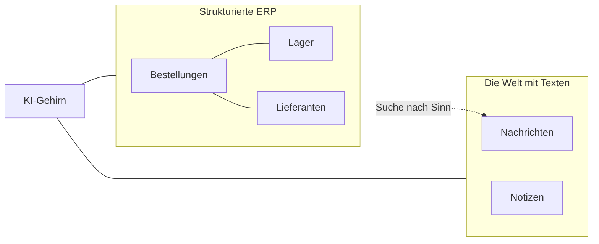

# Resilienz.AI — Strategie für Datenbanken 🧠🗃️

Resilienz.AI nutzt zwei Arten von Datenbanken. Eine für Zahlen (SQL) und eine für Sinn und Texte (RAG/Vector).

---

## 🏗️ Das hybride Modell

Experten nutzen dieses Modell für moderne KI-Systeme. So hat man Präzision und Verstehen der Sprache.

| Art der Datenbank | Wahl | Rolle | Stärke |
|-------------------|------|-------|--------|
| **Relational (SQL)** | **SQLite** | Interne Daten | Genaue Zahlen, Daten und Status. |
| **Vector (RAG)** | **ChromaDB** | Externe Weltnachrichten | Sinn, Texte und gute Suche. |

---

## 🗃️ 1. Strukturierte Daten (SQLite)
Das ist der **Speicher der Fakten**. Hier stehen Dinge, die fest sind.
- **Tabellen**: `Bestellungen`, `Lieferanten`, `Lager-Inventar`, `Lieferanten-Status`.
- **Beispiel**: "Welche Bestellungen haben mehr als 5 Tage Verspätung?"
- **Genauigkeit**: Wenn die Zahl 7 ist, bedeutet das genau 7.

---

## 🧠 2. Sinn und Texte (ChromaDB)
Das ist das **Gedächtnis für das Gehirn**. Es speichert Texte als Zahlen (Embeddings).
- **Sammlung**: `Weltnachrichten`.
- **Beispiel**: "Finde Nachrichten über meine deutschen Lieferanten."
- **Verstehen**: ChromaDB weiß: Ein "Streik im Hamburger Hafen" ist wichtig für einen "Verzug bei der Schifffahrt". Auch wenn das Wort "Streik" nicht gesucht wird.

---

## 🧪 Die Ebene für Szenarien (Schatten-Daten)
Für Live-Tests (Beispiel: Suez Kanal) gibt es eine **dynamische Ebene**.
- **Speicher im Server**: Aktuelle Tests sind im Speicher des Flask-Servers.
- **Kombination**: Das Programm kombiniert Daten aus SQL mit den neuen Tests (Overrides).
- **Zurücksetzen**: Ein Klick und das System ist wieder im normalen Zustand.

---

## 🔄 Das Modell für die Suche (Hybrid Search)

Das ist der Weg der KI bei einer Prüfung:

1.  **Schritt 1: SQL Daten**: Die KI holt Zahlen für eine Verspätung (Beispiel: "7 Tage Verspätung, Vorrat für 2 Tage").
2.  **Schritt 2: Vector Suche**: Die KI sucht Nachrichten in ChromaDB für den Ort des Lieferanten.
3.  **Schritt 3: Kombination**: Die KI kombiniert den **Fakt** (Verspätung) mit dem **Sinn** (Hafen-Streik) für den Bericht.

---

## 📐 Verbindung der Daten

---

## 🚀 Der Weg in die Produktion

| Stufe | SQL Ebene | Vector Ebene |
|-------|-----------|--------------|
| **Demo (Projekt)** | SQLite (Datei lokal) | ChromaDB (Ordner lokal) |
| **Pilot (Kleine Firma)** | PostgreSQL | ChromaDB |
| **Produktion (Groß)** | PostgreSQL | Pinecone / Weaviate |

Da wir Werkzeuge (Tools) in Python nutzen, arbeitet das Programm immer gleich. Egal ob lokal oder in der Cloud.
