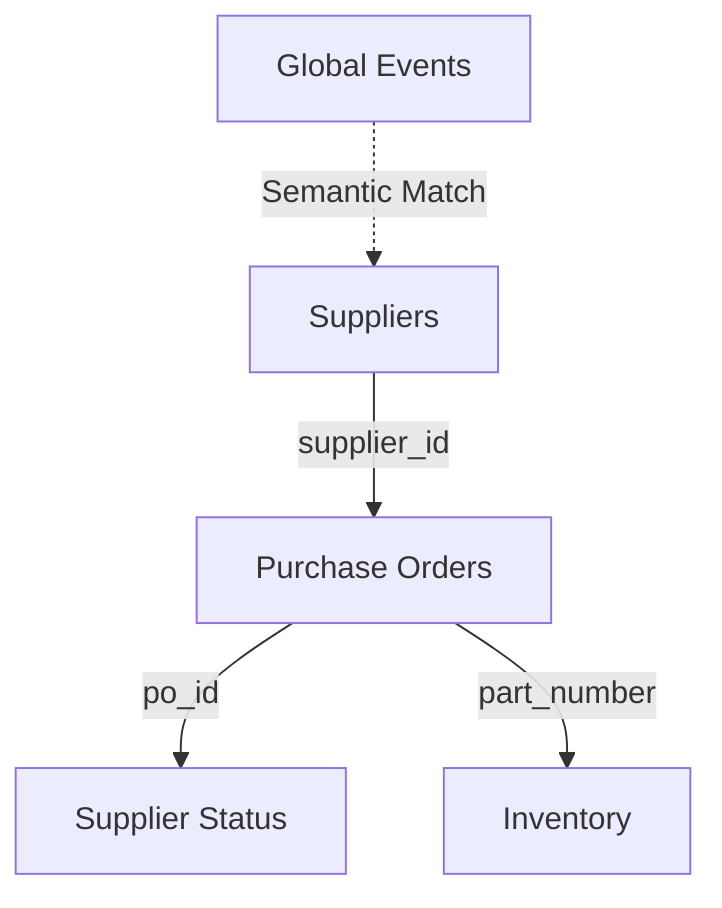

# Resilienz.AI — Data Architecture 📊

Resilienz.AI operates on a **Three-World Data Model**. To provide a realistic demo, the system simulates internal ERP data, supplier feeds, and external global events.

---

## 🌎 The Three-World Model

| World | Data Type | Storage | Role |
|-------|-----------|---------|------|
| **Internal** | Purchase Orders, Inventory | SQLite | Tracks what we've ordered and what's in stock. |
| **Supplier** | Confirmations, Delays | SQLite | Tracks what the vendors are saying about our orders. |
| **External** | News, Strikes, Disasters| **ChromaDB** | Tracks global events that might impact our supply chains. |

---

## 📂 Core Data Entities

### 1. Purchase Orders (`purchase_orders.csv`)
The heartbeat of the cockpit. Tracks `po_id`, `supplier_id`, `part_number`, and `criticality`.
- **Why Criticality?**: High-criticality parts (e.g., custom sensors) trigger immediate AI alerts if delayed, while low-criticality parts (e.g., standard bolts) are handled as routine updates.

### 2. Supplier Status (`supplier_status.csv`)
Real-time updates directly from vendor portals.
- **Key Fields**: `delay_days`, `delay_reason`, and `confidence_level`.
- **Insight**: By joining this with the Purchase Orders, the agent instantly spots schedule slips.

### 3. Inventory (`inventory.csv`)
Current stock levels and warehouse buffers.
- **Days of Cover**: Calculated as `stock / daily_consumption`.
- **The Equation**: If `delay_days > days_of_cover`, the AI identifies a **Production Stopper**.

### 4. Supplier Master (`suppliers.csv`)
Historical reliability profiles.
- **Reliability Score**: 0.0 to 1.0 (historical on-time rate).
- **Alternative Supplier**: The "Plan B" vendor ID used for emergency re-routing.

### 5. Global Events (`global_events.csv`)
Stored in **ChromaDB (Vector DB)** for semantic search.
- **Events**: Port strikes, energy crises, or transport blockages.
- **Discovery**: The agent searches this not by "keywords" but by **meaning** (e.g., "Find disruptions near my German suppliers").

---

## 🔄 Data Connectivity (ER Model)

---

## 🎭 Simulated Scenarios
The system is designed to generate "Realistic Bad Scenarios" for the demo:
- 🚨 **The Crisis**: A high-criticality order delayed by a port strike with only 1 day of stock left.
- 🔄 **The Pivot**: A delay detected where a reliable alternative supplier is already on file.
- ✅ **The Baseline**: Healthy on-time deliveries with stable stock levels.

---

## 🧪 The Dynamic Scenario Layer (New)
To support **Peak Demo** requirements, a "Shadow Data" layer was added:
- **`_active_overrides`**: An in-memory dictionary in `api/app.py` that stores simulated delays.
- **`current_delay_days`**: This field is dynamically calculated merging the base SQLite data with the active Stress-Test scenario.
- **ChromaDB Injection**: Scenarios also inject temporary events into the vector database so the agent can "find" the root cause during an audit.

---

## 🛠️ Data Generation
All data is generated synthetically via `data/generate_data.py`. This ensures:
1.  **Repeatability**: Identical demo data every time.
2.  **Safety**: No real company or supplier data is exposed.
3.  **Control**: Extreme "what-if" scenarios can be injected on demand (see the **Stress-Test Center**).
