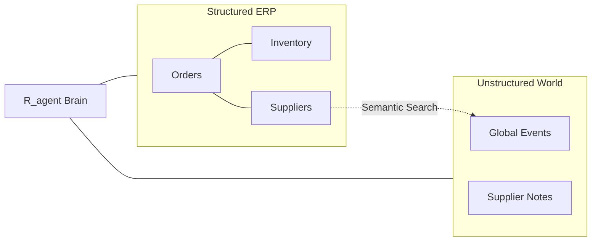

# Resilienz.AI — Database Strategy 🧠🗃️

Resilienz.AI employs a **Hybrid Database Architecture**, combining a traditional relational database (SQL) for structured facts with an advanced vector database (RAG) for semantic context.

---

## 🏗️ The Hybrid Architecture

Senior engineers use this "Dual-Engine" approach in production AI systems to ensure both **mathematical precision** and **linguistic understanding**.

| Database Type | Choice | Role | Strength |
|---------------|--------|------|----------|
| **Relational (SQL)** | **SQLite** | Internal ERP Data | Exact numbers, dates, and statuses. |
| **Vector (RAG)** | **ChromaDB** | External News/Events | Meaning, context, and semantic search. |

---

## 🗃️ 1. Structured Data (SQLite)
Think of this as the **System of Record**. It stores the hard facts that don't change by interpretation.
- **Tables**: `purchase_orders`, `suppliers`, `inventory`, `supplier_status`.
- **Query Example**: *"Which orders are delayed by more than 5 days?"*
- **Precision**: If a field says `delay_days = 7`, the agent knows *exactly* 7.

---

## 🧠 2. Semantic Context (ChromaDB)
Think of this as the **Brain's Memory**. It stores unstructured text as mathematical "embeddings".
- **Collection**: `global_events`.
- **Query Example**: *"Find any news that might affect my German suppliers."*
- **Understanding**: ChromaDB knows that a "Port Strike in Hamburg" is relevant to a "Shipping delay in Northern Germany" even if the keywords don't match.

---

## 🧪 The "Shadow Data" Scenario Layer
To allow real-time simulations (Suez Canal blockage, etc.) without altering the stable **SQLite** baseline, the system implements a **Dynamic Override Layer**:
- **In-Memory Buffer**: Active scenario parameters are stored in a transient buffer within the Flask API.
- **Dynamic Merging**: When the agent or dashboard requests data, the system performs a "Join" between the SQL facts and the in-memory overrides.
- **Instant Reset**: Clearing a scenario simply flushes the buffer, instantly returning the system to its healthy state.

---

## 🔄 The "Hybrid Search" Pattern

This is the professional pattern used by R_agent during every audit:

1.  **Step 1: SQL Extraction**: The agent pulls the hard numbers for a delayed order (e.g., "7 days late, 2 days of stock left").
2.  **Step 2: Vector Retrieval**: The agent searches ChromaDB for any global events matching the supplier's location or the part type.
3.  **Step 3: Synthesis**: The agent combines the **Fact** (the delay) with the **Context** (the port strike) to generate the final assessment.

---

## 📐 Data Relationships

---

## 🚀 Migration Path

| Stage | SQL Layer | Vector Layer |
|-------|-----------|--------------|
| **Demo (Project)** | SQLite (Local File) | ChromaDB (Local Folder) |
| **Pilot (Small SME)** | PostgreSQL | ChromaDB |
| **Production (Scale)** | PostgreSQL | Pinecone / Weaviate |

By abstracting these database calls behind Python tools, the application logic remains identical whether running locally or in a massive cloud environment.
